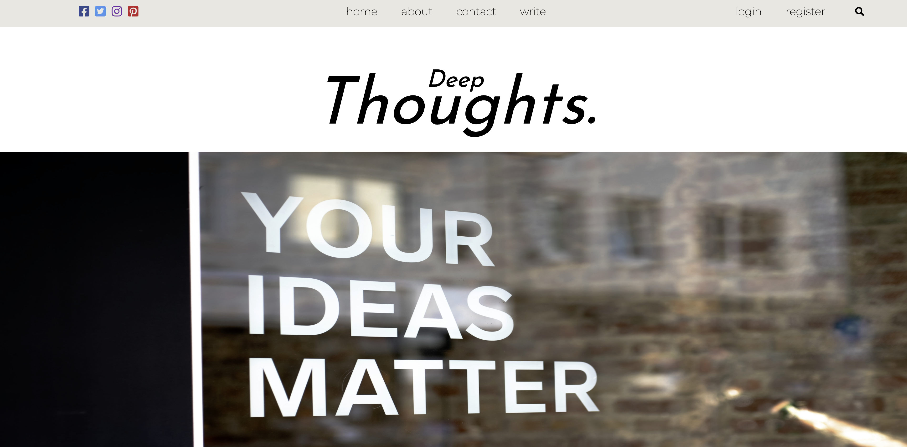
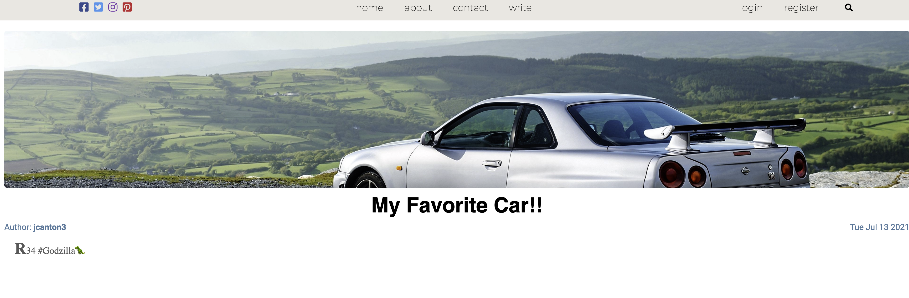
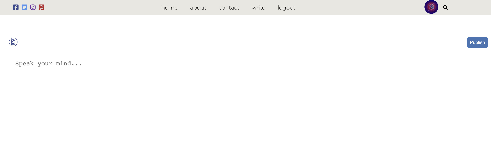
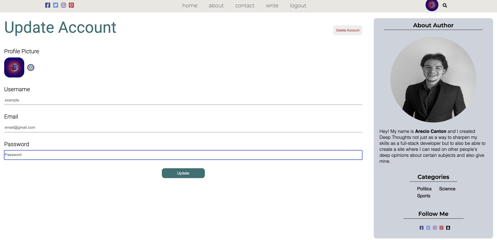

# Deep Thoughts
  
  
  # Live Site
  [Link](https://deep-thoughttss.herokuapp.com/)

  # Table of Contents 
  * [Installation](#Installation) 
  * [Usage](#Usage) 
  * [License](#license)
  * [Contributing](#Contribute) 
  * [Testing](#Testing)
  * [Questions](#Questions)
  
  # Description 
Make an account and create blogs of your Deep Thoughts with the help of Mongoose and Express routes a user will have secure and private accounts, read they're own as well as other users blogs in the main dashboard if the blog was posted by the user then only they are allowed to edit the blog, if not they are only show the date, time, and user associated with the blog. You are also permitted with the help of Multer upload an image from your computer for your blog thumbnail and user profile. Not only are you able to search blogs through the dashboard but by also by category.

</img>
</img>
</img>
</img>
</img>
</img>
</img>
  
  # Installation
   **npm i**

  # Contribute
  **Create pull request**

  # Usage
  **git clone**

  # Questions
  If you had any questions feel free to contact my email cuba289@gmail.com

  To see more of my work visit me here [Arecio3](https://github.com/Arecio3)

  # License
  

